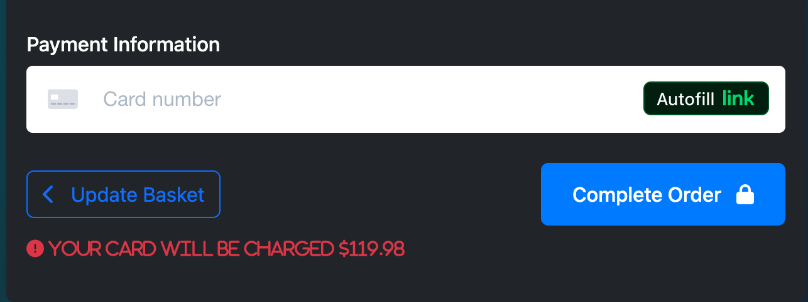

# Deep State E-commerce Website

A modern e-commerce website built with Django, featuring product management, shopping cart, checkout, and admin dashboard functionality.

## Features Overview

### Home Page

#### Quick access to product categories

#### Shopping cart summary in header

#### Hero section with call to action

### Products Page
- Product filtering and sorting
- Product details including:

  - Product name and description
  - Price and rating
  - Add to basket functionality
 
### Shopping Basket

- View all items in your basket
- Update quantities
- Remove items with confirmation
- Calculate subtotal and delivery
- Proceed to checkout

### Checkout

- Secure payment processing with Stripe

- Delivery information collection

- Order summary and confirmation

### User Account
- User registration and login
- Order history

### Admin Dashboard
- Product management:
  - Add, edit, and delete products
  - Manage product categories
  - View product statistics
- Order management:
  - View all orders
  - Update order status
  - Generate sales reports
- User management:
  - View all users
  - Manage user permissions
  - View user activity
 
### Wireframes

 
## Technical Requirements

- Python 3.12+
- Django 3.2.25
- PostgreSQL database
- Stripe API for payments
- Django Allauth for authentication
- Django Widget Tweaks for form styling
- Pillow for image processing
- Heroku for deployment

Acknowledgements
Thank you to the student care team for their understanding and patients, my family and my brand new baby boy
